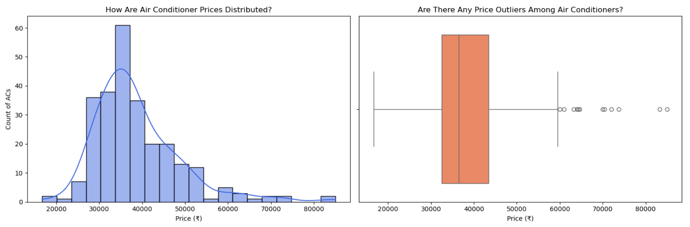
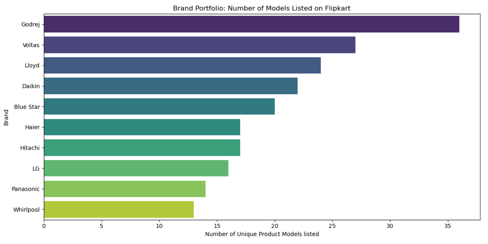
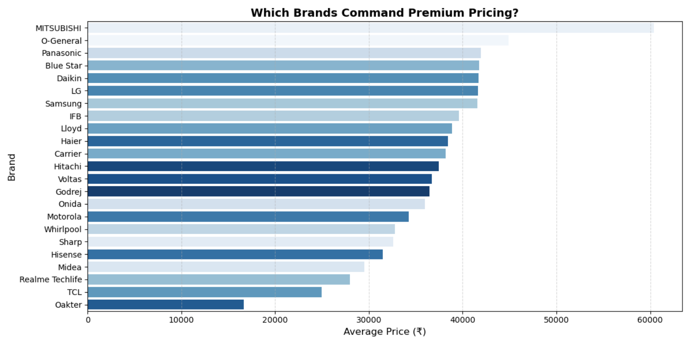
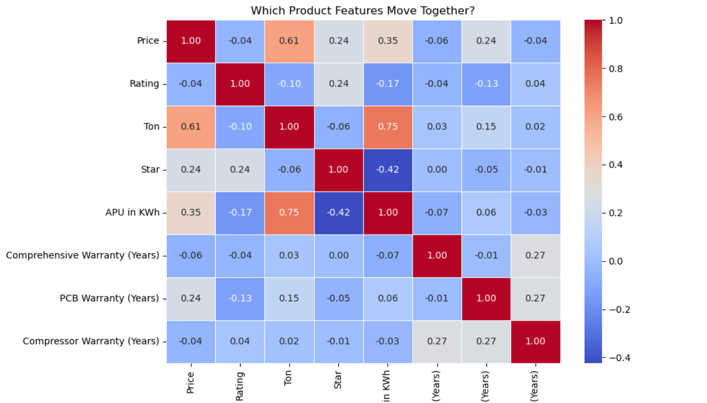
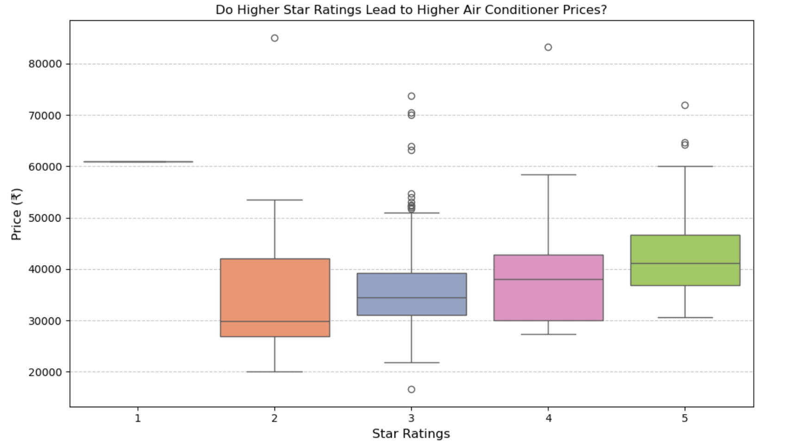
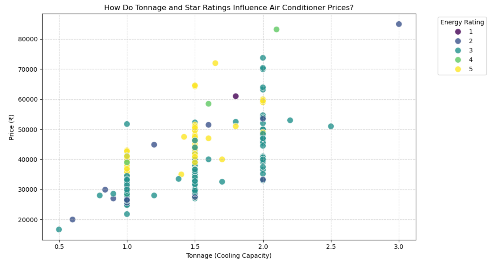

# 🛒 Flipkart AC Price Analysis using Web Scraping, Data Cleaning & EDA

## 📌 Project Overview

This project demonstrates an end-to-end Data Analytics workflow by collecting Air Conditioner product data from Flipkart through web scraping, cleaning and preprocessing the dataset, and performing Exploratory Data Analysis (EDA) to identify the factors influencing AC prices.

The objective is to transform raw web data into meaningful business insights using Python and data visualization techniques.

---

## 🎯 Problem Statement

Air Conditioner prices vary significantly depending on brand, capacity, ratings, and product specifications. This project aims to analyze these factors and understand what influences pricing in the online marketplace.

---

## 🚀 Project Highlights

- Collected real-world product data from Flipkart using web scraping
- Cleaned and preprocessed the raw dataset
- Performed Exploratory Data Analysis (EDA)
- Created visualizations to uncover pricing trends
- Generated business insights from the analysis

---

## 📂 Dataset

The dataset was collected directly from Flipkart using Python.

It includes information such as:

- Brand
- Product Name
- Price
- Tonnage
- Star Rating
- Product Specifications
- Features

---

## 🛠️ Technologies Used

- Python
- Pandas
- NumPy
- Matplotlib
- Seaborn
- Requests
- BeautifulSoup

---

## 📊 Project Workflow

1. Data Collection using Web Scraping
2. Data Cleaning
3. Data Preprocessing
4. Exploratory Data Analysis (EDA)
5. Data Visualization
6. Business Insight Generation

---

## ❓ Business Questions Answered

- How are AC prices distributed?
- Which brands offer the largest number of products?
- Which brands have the highest average prices?
- Is there a relationship between tonnage and price?
- How do star ratings influence pricing?
- Which features appear most frequently in premium AC models?

---

## 📈 Key Insights

- Most Air Conditioners fall within the mid-price range.
- Premium brands generally command higher average prices.
- Higher tonnage is associated with higher prices.
- Better energy-efficiency ratings tend to correspond with higher-priced models.
- Brand reputation has a noticeable impact on pricing.

---

## 📷 Visualizations

The project includes visualizations such as:

### Price Distribution


---

### Brand Distribution


---

### Average Price by Brand


---

### Correlation Heatmap


---

### Star Rating vs Price


---

### Combined Effect of Star Rating & Tonnage on Price


---

## 📁 Repository Structure

```
Flipkart-AC-Price-Analysis-EDA/
│
├── Flipkart_AC_Price_Analysis.ipynb
├── Raw Air Conditioners File.csv
├── requirements.txt
├── README.md
└── Images/
```

---

## 💡 Skills Demonstrated

- Web Scraping
- Data Cleaning
- Exploratory Data Analysis (EDA)
- Data Visualization
- Business Insight Generation
- Python Programming
- Data Analytics Workflow

---

## 🔮 Future Improvements

- Automate data collection
- Collect historical pricing data
- Build a Machine Learning model for price prediction
- Develop an interactive Power BI dashboard

---

## 👨‍💻 Author

**Pavan Kalyan**

If you found this project interesting, feel free to explore the repository and share your feedback.
